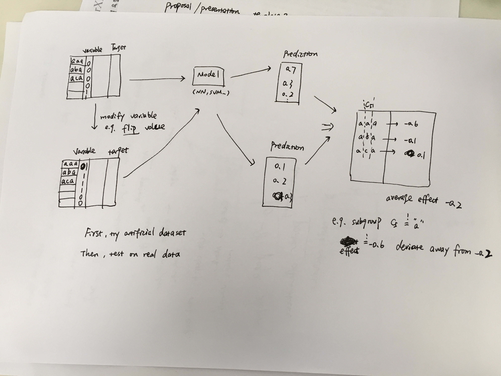
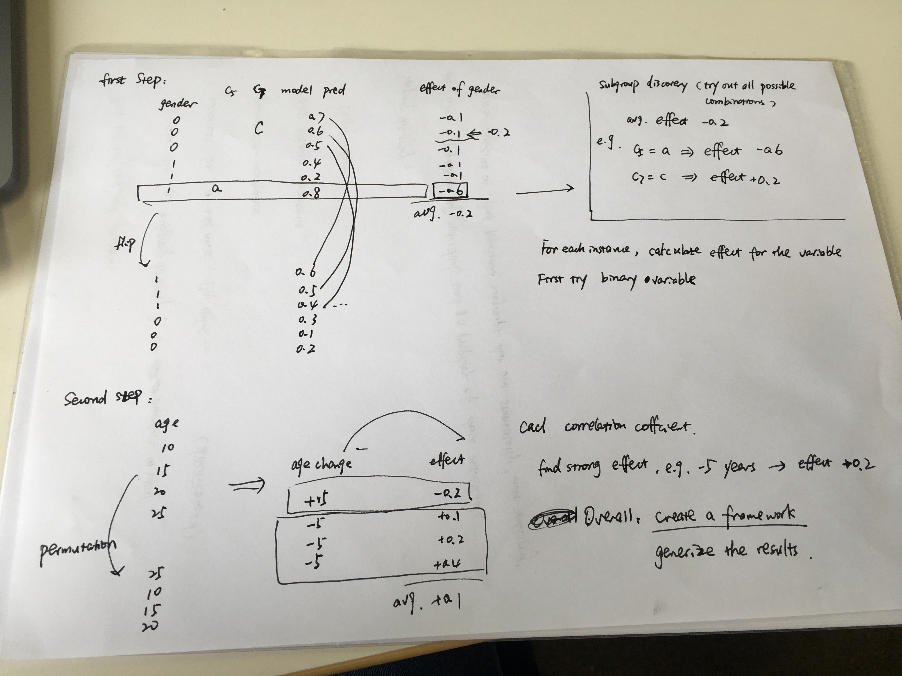

**Meeting 2019-04-16**

- datasets -- [UCI datasets](https://archive.ics.uci.edu/ml/datasets.php) 

- idea: first, we have some measurements, like importance score or average effect on the variable, e.g. 50% or 20% of importance. Then, we modify the variable(flip value, or remove variable), and find subgroups with stronger effect or reverse effect.
- first do some experiments on artificial datasets, using decision tree to see the effect. Then test on real datasets, e.g. text classification to see the effect of "gender"...
- extensions (further direction): on different models, like Markov chain model; effect on multiple variables; how to handle categorial variables; etc. 

- 6-8 pages proposal: introduction, related work, initial experiments, further experiments, further extensions, timeline/milestones

- After final submission: short summary for a Poster

- Code open source
  

  

#### 2019-04-30

- Overall, create a framework to identify effect of the variables

#### 2019-05-08

- data types
  - structured data: nominal/numeric, (maybe try sequential data)
  - unstructured data: text, image (maybe not a good idea)
- subgroup discovery task on target date type
  - try exceptional pattern mining --> the combination of several targets
- quality measure? trade off between generality, precision and interest
  - not sure what to do next. maybe write a new quality measure
  - **test quality measure stability** 
- final work: a package based on pysubgroup, create a framework to identify the attribute effect under some circumstances through subgroup discovery.

**Next step to do!**

- Exceptional pattern mining, correlation between "age change" and "prediction change"
- **Shapley** value for each instances, it can be regarded as "effect" for each instance, then mine subgroup
- Comparison between subgroups mined by Shapley and mean effect
- Avoid redundancy in subgroups --> calculate mean effect of each subgroup, to identify whether this subgroup is a good subgroup??

- **Start to write proposal**: weeks for small experiments, weeks for literature review, weeks for preparing datasets, weeks for conducting experiments, weeks for writing thesis...

#### 2019-05-28

**Refine research questions:**

- how to **characterize** the importance of a specific variable in a black-box model?
- how to discover interesting subgroups under consideration?
  - how to avoid redundancy
  - how to test stability? variance on training data vs. variance on test data

Settings comparison:

- subgroup discovery vs. decision tree
- classification model vs. regression model
- training dataset vs. testing dataset

**Presentation: 18.06.2019 time: about 30 minitues**

#### 2019-07-02

- Refine flip binary feature functions
  - flip attribute effect from one direction to another, e.g. male -> female
  - calculate absolute flip attribute effect 
- Visualize decision tree using "effect" as the target **VS.** subgroup discovery task using "effect" as target
- deal with subgroup discovery redundancy problem (compare with base subgroup)
- quick prototype on neural network with shap library
- image, pixels groups? later
- meeting before August 1st

#### 2019-07-16

- try dummy encoding on categorical features

- recheck incremental redundancy measure (closed subgroup)

- generate artificial dataset (e.g. use two models to see effect)

- phrase sentence like "under which circumstances, this variable has some effects", e.g. when edu-num=13, it has particularly high chance to earn more than 50K. or when age < 50, sex has more impact while predicting the results

- extensions on "closed subgroup"

- extensions on "text data" 

  - subgroup: categories == 'car', mean importance(sentimental) score
  - target: mean importance(sentimental) score for a sentence

- **Write thesis structure & Introduction**

  

